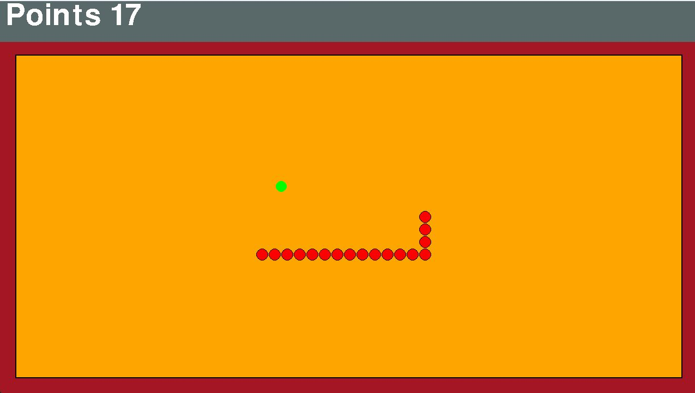

# pySnakeGame
This repository is intended for study in game development and study of software architecture.

This project also serves as a sample/example codebase demonstrating usage of the [LightGameEngine](https://github.com/MarcusPaiva/LightGameEngine) library (published on [PyPI](https://pypi.org/project/LightGameEngine/)).



## Install
First install all python packages using:
````commandline
pip install -r requirements.txt
````

## RUN GAME!
````commandline
python main.py
````

## Running tests
Install the dev dependencies (includes pytest) and run:
````commandline
pip install -r requirements-dev.txt
pytest
````
Tests run headlessly (no window opens) using pygame's dummy video/audio drivers.

## Initial goals

Create intro;

Create main menu;

Create pause menu;

Add point markers;